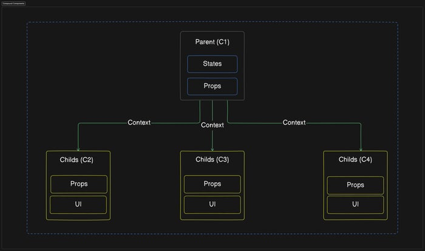

# ✨ Compound 패턴

## 1. 패턴 정의: 정의와 핵심 요약

- Compound 패턴은 상위 컴포넌트가 내부 상태(`state`)와 로직을 보관하고, 하위 컴포넌트들이 이를 공유해 하나의 기능 단위를 구성하는 패턴이다.
- 주로 UI 컴포넌트 라이브러리에서 사용되며, 부모–자식 컴포넌트 조합을 통해 상태를 공유하면서 유연하게 구조를 만들 수 있다.

## 2. 사용 목적: 이 패턴이 필요한 이유

- 여러 관련된 UI 하위 컴포넌트를 하나의 상위 컴포넌트로 묶어, 직관적인 JSX 구조로 API를 설계할 수 있다.
- 클라이언트 코드는 단순히 컴포넌트 트리 구조만 작성하면 되므로 가독성과 재사용성이 높아진다.

## 3. 패턴 설명: 동작 방식과 구성 요소



### 구성 요소

> Parent (상위 컴포넌트)

- 공통된 상태와 로직을 관리하는 중심 역할.
- 하위 컴포넌트를 감싸면서, 필요한 상태나 함수를 전달한다.

> Child (하위 컴포넌트)

- Parent 내부에서만 의미를 가지는 UI 단위.
- Parent가 제공하는 상태와 함수를 기반으로 동작하며, 보통 Parent.Child 형태로 노출된다.

### 동작 방식

- Parent는 하나의 상태를 소유하고, 이를 Child에게 전달한다.
- Child는 전달받은 상태를 기반으로 각자 UI와 로직을 수행한다.
- 클라이언트 코드는 `<Parent><Parent.Child/></Parent>` 같은 구조를 선언하기만 하면, 내부적으로 상태가 공유되고 일관성 있게 동작한다.
- 상태 공유는 `props`, `cloneElement`, `Context` 등 다양한 방법으로 구현될 수 있다.

## 4. 코드 및 활용 예시: 기본 구현과 프론트엔드 적용

```tsx
import React, { createContext, useContext, useState } from "react";

const FlyOutContext = createContext(null);

function FlyOut({ children }) {
  const [open, setOpen] = useState(false);

  return (
    <FlyOutContext.Provider value={{ open, setOpen }}>
      {children}
    </FlyOutContext.Provider>
  );
}

// 하위 컴포넌트: Toggle
FlyOut.Toggle = function Toggle() {
  const { open, setOpen } = useContext(FlyOutContext);
  return (
    <button onClick={() => setOpen(!open)}>{open ? "닫기" : "열기"}</button>
  );
};

// 하위 컴포넌트: List
FlyOut.List = function List({ children }) {
  const { open } = useContext(FlyOutContext);
  return open ? <ul>{children}</ul> : null;
};

export default FlyOut;
```

```tsx
<FlyOut>
  <FlyOut.Toggle />
  <FlyOut.List>
    <li>🍇 포도</li>
    <li>🍎 사과</li>
    <li>🍌 바나나</li>
  </FlyOut.List>
</FlyOut>
```

- `FlyOut`은 공통 상태(`open`)를 관리하는 `Parent` 역할.
- `FlyOut.Toggle`과 `FlyOut.List`는 `Child`로서 `open` 상태를 공유한다.
- 클라이언트 코드에서는 단순히 JSX 구조만 조합해도, 내부적으로 상태가 일관되게 동작한다.

## 5. 정리와 확장: 학습 포인트와 추가 학습거리

### 학습 포인트

- `Compound` 패턴은 여러 관련된 하위 컴포넌트를 상위 컴포넌트 안에 묶어, 직관적인 JSX API를 제공한다.
- 클라이언트는 단순히 트리 구조를 조합하는 것만으로 의도한 UI를 쉽게 구성할 수 있다.
- 상태 공유는 `props`, `cloneElement`, `Context` 등으로 구현 가능하며, React에서는 주로 `Context`가 사용된다.
