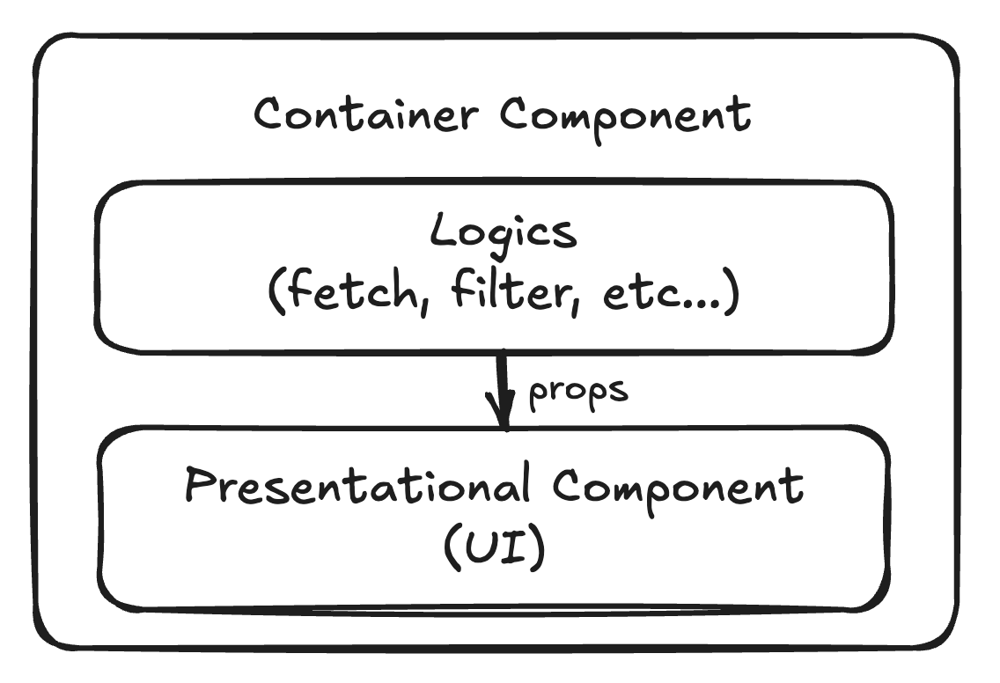

# ✨ Container/Presentational 패턴

## 1. 패턴 정의: 정의와 핵심 요약

- UI 구성 요소를 역할에 따라 데이터 중심(`Container`) 과 표현 중심(`Presentational`) 으로 분리하는 구조적 패턴이다.
- 관심사의 분리를 통해 컴포넌트 재사용성과 유지 보수성을 높인다.

## 2. 사용 목적: 이 패턴이 필요한 이유

- UI와 로직을 한 컴포넌트에 모두 담으면, 재사용성이나 유지보수 측면에서 비효율이 발생한다.
- 로직과 화면을 분리하면 역할이 명확해지고, 테스트와 변경이 쉬워진다.
- Presentational 컴포넌트는 재사용 가능한 UI 단위로 분리할 수 있고, Container는 데이터 흐름과 상태를 책임진다.
- 결국 관심사의 분리를 통해 코드의 가독성, 유지보수성, 확장성을 높일 수 있다

## 3. 패턴 설명: 동작 방식과 구성 요소



> 구성 요소

- Container Component: 상태 관리, 데이터 fetching, 이벤트 핸들링을 담당
- Presentational Component: props를 받아 UI만 담당

> 동작 흐름

- Container가 데이터를 수집하거나 처리한 뒤
- Presentational 컴포넌트에 props로 전달하여 렌더링

## 4. 코드 및 활용 예시: 기본 구현

> Container/Presentational 패턴은 다음과 같이 역할을 분리하여 구성한다:

- Presentational 컴포넌트: 순수 UI 구성에만 집중. 외부로부터 데이터를 `props`로 받으며 내부 상태를 가지지 않음.
- Container 컴포넌트: 데이터 패칭, 상태 관리, 이벤트 핸들링 등 로직 중심 기능 담당.

```tsx
// UserList.tsx - Presentational Component
const UserList = ({ users, onSelectUser }) => (
  <ul>
    {users.map((user) => (
      <li key={user.id} onClick={() => onSelectUser(user)}>
        {user.name}
      </li>
    ))}
  </ul>
);
```

```tsx
// UserListContainer.tsx - Container Component
class UserListContainer extends React.Component {
  state = {
    users: [],
  };

  componentDidMount() {
    fetch("/api/users")
      .then((res) => res.json())
      .then((data) => this.setState({ users: data }));
  }

  handleSelectUser = (user) => {
    console.log("User selected:", user);
  };

  render() {
    return (
      <UserList users={this.state.users} onSelectUser={this.handleSelectUser} />
    );
  }
}
```

## 5. 정리와 확장: 학습 포인트와 추가 학습거리

### 학습포인트

- Container/Presentational 패턴은 관심사의 분리를 실현하기 위한 구조적 접근이다.
- UI는 단순히 props를 받아 렌더링하고, 로직은 별도의 Container에서 처리함으로써 테스트 용이성, 재사용성, 유지보수성을 높일 수 있다.
- 이 패턴은 비즈니스 로직과 뷰 로직을 명확하게 구분하고자 할 때 특히 유용하다.
- 그러나 컴포넌트 수가 많아지고 `props` 전달이 복잡해지면 `Props drilling`이 발생할 수 있다.
- 이 구조적 단점을 보완하고자 등장한 것이 `Custom Hook` 기반의 분리 방식이다.

### 추가 학습: Hook과의 비교

- Custom Hook은 Container 컴포넌트의 역할을 대체할 수 있는 현대적인 방식이다.
- Hook을 사용하면 로직을 함수 형태로 캡슐화해 컴포넌트 구조는 더 단순하게 유지하면서도 기능을 재사용할 수 있다.
- Container는 사라지고, 대신 `useSomething()` 형태의 훅으로 상태와 이벤트 핸들러를 관리하며, UI 컴포넌트는 그대로 Presentational 역할을 유지한다.
- 관심사 분리라는 설계 철학은 동일하나, 구현 방식이 React의 발전에 따라 진화한 것이라 볼 수 있다.

```tsx
// Custom Hook 예시
function useUsers() {
  const [users, setUsers] = useState([]);

  useEffect(() => {
    fetch("/api/users")
      .then((res) => res.json())
      .then(setUsers);
  }, []);

  return { users };
}

// UI 컴포넌트에서 사용
const UserList = () => {
  const { users } = useUsers();
  return (
    <ul>
      {users.map((user) => (
        <li key={user.id}>{user.name}</li>
      ))}
    </ul>
  );
};
```
