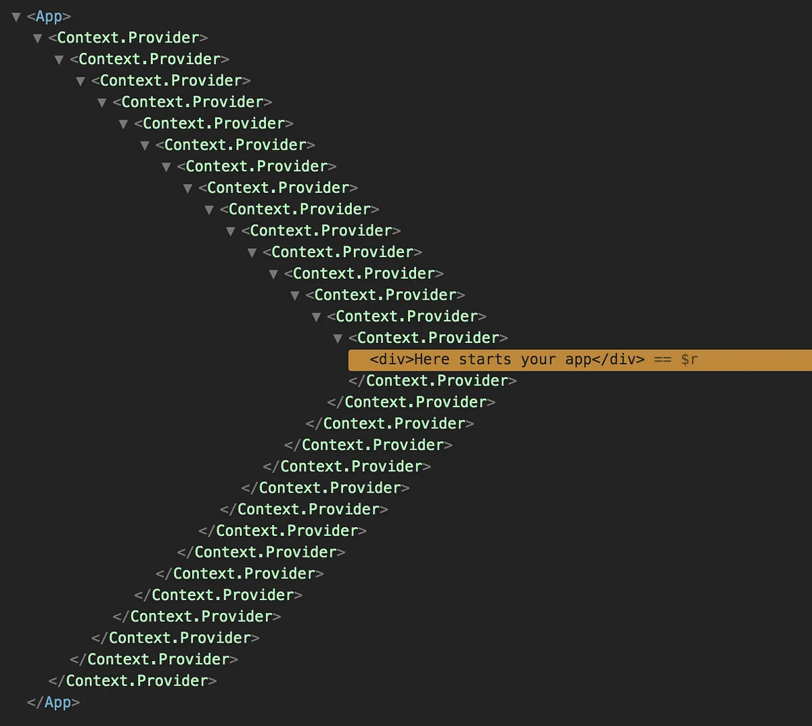

# ✨ HOC 패턴

## 1. 패턴 정의: 정의와 핵심 요약

- HOC는 기존 컴포넌트를 인자로 받아, 추가 로직을 덧붙인 새로운 컴포넌트를 반환하는 패턴이다.
- 여러 컴포넌트에서 반복되는 로직을 한 곳에 모아, 재사용성을 높이고 관심사를 분리할 수 있다.

## 2. 사용 목적: 이 패턴이 필요한 이유

- 중복된 로직(스타일링, 권한 처리, 로딩 등)을 여러 컴포넌트마다 작성하지 않고 한 곳에서 관리하고 싶을 때 사용한다.
- 원본 컴포넌트의 내부 코드를 수정하지 않고도, 새로운 기능이나 데이터 소스를 주입하고 싶을 때 사용한다.

## 3. 패턴 설명: 동작 방식과 구성 요소


### 구성요소

- HOC 함수: 원본 컴포넌트를 받아 새로운 컴포넌트를 반환하는 함수.
- Wrapped Component: HOC에 의해 감싸지는 원본 컴포넌트.

### 동작 방식

- HOC 함수는 원본 컴포넌트를 받아 새로운 컴포넌트를 반환한다.
- 반환된 컴포넌트 내부에서 공통 로직을 실행하거나, 추가 props를 주입한 뒤 원본 컴포넌트를 렌더링한다.
- 원본 컴포넌트는 이를 “주입받은 props”를 통해 마치 자신의 로직처럼 활용한다.

### 대표적인 HOC 예시

- `React.memo`: props 변경 여부를 기준으로 불필요한 리렌더링을 방지
- `withAuthGuard`: 인증/권한 없는 사용자의 접근 차단
- `withErrorBoundary`: 렌더링 에러를 잡고 안전한 UI로 대체

### 장단점

> 장점

- 코드 중복 제거, 재사용성 향상
- 관심사 분리: UI 컴포넌트와 로직/데이터 처리 로직 분리 가능

> 단점

- props 이름 충돌 위험
- 여러 HOC를 중첩하면 디버깅이 어려워짐 (“Wrapper Hell”)



## 4. 코드 및 활용 예시

### React.memo

```tsx
import React from "react";

type UserCardProps = { name: string; age: number };
function UserCard({ name, age }: UserCardProps) {
  console.log("render:", name);
  return (
    <div>
      {name} ({age})
    </div>
  );
}
export const MemoUserCard = React.memo(UserCard);
```

```tsx
<MemoUserCard name="Alice" age={30} />
```

### withAuthGuard

```tsx
import React from "react";
import { Navigate } from "react-router-dom";

function useAuth() {
  const user = { id: "123", role: "user" } as null | {
    id: string;
    role: string;
  };
  return { user };
}

type AnyComp = React.ComponentType<any>;

export function withAuthGuard<ComponentProps>(Wrapped: AnyComp) {
  const Guard: React.FC<ComponentProps> = (props) => {
    const { user } = useAuth();
    if (!user) return <Navigate to="/login" replace />;
    return <Wrapped {...props} />;
  };
  Guard.displayName = `withAuthGuard(${
    Wrapped.displayName || Wrapped.name || "Component"
  })`;
  return Guard;
}
```

```tsx
const SettingsPage = () => <div>Settings</div>;
export default withAuthGuard(SettingsPage);
```

### withErrorBoundary

```tsx
import React from "react";

// Error Boundary는 클래스 컴포넌트여야 렌더 에러를 잡을 수 있음
class ErrorBoundary extends React.Component<
  { fallback?: React.ReactNode },
  { hasError: boolean }
> {
  constructor(props: any) {
    super(props);
    this.state = { hasError: false };
  }
  static getDerivedStateFromError() {
    return { hasError: true };
  }
  componentDidCatch(error: any, info: any) {
    console.error("Caught by ErrorBoundary:", error, info);
  }
  render() {
    if (this.state.hasError)
      return this.props.fallback ?? <div>Something went wrong.</div>;
    return this.props.children;
  }
}

type AnyComp = React.ComponentType<any>;

export function withErrorBoundary<ComponentProps>(
  Wrapped: AnyComp,
  fallback?: React.ReactNode
) {
  const WithBoundary: React.FC<ComponentProps> = (props) => (
    <ErrorBoundary fallback={fallback}>
      <Wrapped {...props} />
    </ErrorBoundary>
  );
  WithBoundary.displayName = `withErrorBoundary(${
    Wrapped.displayName || Wrapped.name || "Component"
  })`;
  return WithBoundary;
}
```

```tsx
const Crashy = () => {
  throw new Error("boom");
};
export default withErrorBoundary(Crashy, <div>⚠️ 에러</div>);
```

## 5. 정리와 확장: 학습 포인트와 추가 학습거리

### 학습 포인트

- HOC는 컴포넌트를 인자로 받아 새 컴포넌트를 반환하는 패턴으로, 공통 로직을 재사용하고 관심사를 분리하는 데 유용하다.
- 훅 등장 이후, 단순한 “데이터 주입/상태 연결” 목적의 HOC는 훅으로 대체되는 추세다.
- 다만 “원본 컴포넌트를 수정하지 않고 감싸야 하는” 요구가 있을 때 HOC의 장점이 살아난다.

### 추가 학습: Container–Presentational 패턴과 HOC의 차이

> 성격 차이

- Container–Presentational: “데이터/비즈니스 로직”과 “UI 표현”을 분리하자는 설계 원칙
- HOC: 위 원칙(또는 다른 관심사 분리)을 구현하는 기법 중 하나

> 구현 방법 다양성

- 동일한 원칙을 HOC뿐 아니라 커스텀 훅 + 얇은 컨테이너, 또는 Render Props로도 구현 가능

> 권장 흐름

- 데이터/비즈니스 로직은 커스텀 훅으로 캡슐화 → 화면에서는 컨테이너가 훅을 호출해 프리젠테이셔널 컴포넌트에 props로 전달
- HOC는 “프로젝트 전반의 기존 컴포넌트들을 수정 없이 공통 규칙으로 감싸야 할 때” 선택

### 추가 학습: 훅으로 대체가 어려운 HOC

> Error Boundary(렌더링 에러 포착)

- 현재 React에선 컴포넌트 경계가 필요하며, 훅만으로 렌더 단계 에러를 잡을 수 없다.
- withErrorBoundary(Component) 형태의 HOC/래퍼가 실용적이다.

> 강제 래핑이 필요한 경우

- 원본을 수정하지 않고 전역적으로 Provider/레이아웃/데코레이터를 적용해야 할 때(테마, 추적, 접근 가드 등).
- 훅은 컴포넌트 내부에서만 호출 가능하므로, 외부에서 일괄 적용하려면 HOC가 적합하다.
