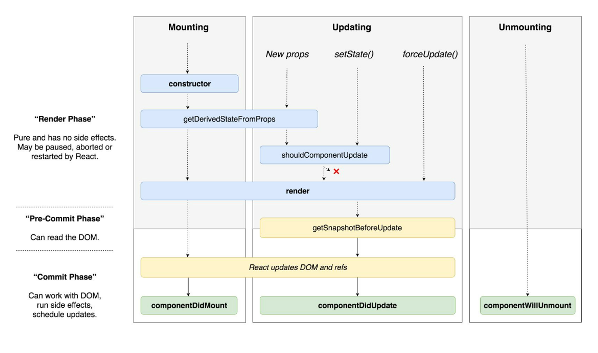

# ✨ Hook 패턴

## 1. 패턴 정의: 정의와 핵심 요약

- 훅(Hooks)은 함수형 컴포넌트에서 상태와 생명주기 관련 로직을 관리하고 재사용할 수 있도록 하는 패턴이다.
- 커스텀 훅을 통해 상태 로직을 모듈화·공유할 수 있고, HOC/Render Props보다 간결하다.

## 2. 사용 목적: 이 패턴이 필요한 이유

- 클래스 컴포넌트의 복잡한 생명주기 메서드 문제를 해결
- 로직 재사용성을 높이고, 관심사별로 캡슐화된 코드 작성 가능

## 3. 패턴 설명: 동작 방식과 구성 요소

### 구성 요소

- 기본 훅: `useState`, `useEffect`, `useContext`, `useReducer` 등을 통해 상태 관리, 생명주기 관리, 컨텍스트 접근 등을 처리
- 커스텀 훅: 반복되는 상태 로직을 함수로 추출 → 다양한 컴포넌트에서 동일한 훅을 호출해 재사용


### 동작 방식

> Render Phase (렌더 단계, 순수 계산 단계)

컴포넌트 함수가 호출되어 JSX를 계산한다. 이때 DOM을 건드리지 않는다.

다음 훅들은 “렌더 중” 평가된다 (부수효과 금지):

- `useState` / `useReducer`

  - 현재 `state`를 읽고 JSX 계산에 사용
  - `setState`를 호출하면 업데이트가 스케줄링되고, 다음 렌더에서 새로운 `state`가 반영
  - 초기값 함수(`useState(() => init)`)는 최초 렌더에만 실행

- `useMemo` / `useCallback`

  - 렌더 중 의존성 비교로 메모이제이션된 값을 재사용하거나 재계산

- `useRef`
  - `.current`를 읽고/쓸 수 있으나, 변경해도 리렌더를 일으키지 않는다. DOM 연결은 커밋 이후에 유효
- `useContext` / `useSyncExternalStore`
  - 렌더 중 구독 값을 읽어 JSX 계산에 반영 (`useSyncExternalStore`는 외부 스토어의 일관된 스냅샷을 렌더 중에 제공한다)

> Commit Phase (커밋 단계, DOM 반영 단계)

React가 변경된 DOM을 실제로 적용하고, 브라우저가 페인트한다(Concurrent 모드에서 스케줄링될 수 있음).

커밋 직후 실행되는 훅:

- `useEffect`

  - 페인트 이후 비동기적으로 실행 네트워크 요청, 이벤트 구독, 타이머, 로깅 등 시각적 플리커에 민감하지 않은 작업
  - 의존성 배열로 실행 타이밍 제어(빈 배열이면 마운트 후 1회, deps 변화 시 재실행)

- `useLayoutEffect`

  - DOM 커밋 직후, 페인트 이전에 동기 실행 레이아웃 측정/동기 DOM 읽기-쓰기(예: 스크롤 위치 조정, 포커스 이동)에 사용

- `useInsertionEffect`
  - 매우 이른 커밋 타이밍(레이아웃 전에) 스타일 삽입용 훅(CSS-in-JS 라이브러리용)

> Cleanup Phase (클린업 단계)

다음 중 하나의 시점에 이전 이펙트의 정리 함수가 먼저 호출된다:

- 같은 컴포넌트가 다시 커밋되기 직전(의존성 변경으로 이펙트 재실행하기 전)
- 컴포넌트 언마운트 직전

해당 훅의 클린업 규칙:

- `useEffect`
  - `useEffect(() => { /* 구독 */ return () => { /* 구독 해제 */ } }, [deps])`

## 4. 코드 및 활용 예시: 기본 구현

```tsx
import React, { useState, useEffect } from "react";

function Clock() {
  const [time, setTime] = useState(new Date());

  // 마운트 시 타이머 등록 → 언마운트 시 정리
  useEffect(() => {
    const id = setInterval(() => setTime(new Date()), 1000);
    return () => clearInterval(id); // cleanup
  }, []);

  return <h1>{time.toLocaleTimeString()}</h1>;
}
```

## 5. 정리와 확장: 학습 포인트와 추가 학습거리

### 학습 포인트

- 훅은 React에서 로직 재사용의 표준 도구이다.
- HOC/Render Props의 한계를 극복하면서 코드 가독성과 유지보수를 크게 개선함
- 커스텀 훅은 특히 비즈니스 로직을 UI와 분리하는 데 강력하다.

### 추가 학습: 클래스형 컴포넌트의 생명주기와 비교



> 클래스형 컴포넌트의 생명주기와 상태 관리

React의 클래스 컴포넌트는 크게 생명주기 메서드(lifecycle methods)와 `this.state`/`this.setState`를 통한 상태 관리로 구성된다.

1. 상태 관리 방식

- 선언: 클래스 내부에서 `state = { count: 0 }`처럼 초기값 선언
- 갱신: `this.setState({ count: this.state.count + 1 })` 호출 시 React가 새로운 렌더를 스케줄링
- 특징: setState는 비동기적으로 동작할 수 있으며, 병합(merge) 기반 → 일부 속성만 변경하면 나머지는 유지됨

2. 주요 생명주기 메서드

- constructor: state 초기화, 이벤트 핸들러 바인딩
- componentDidMount: 마운트 직후(첫 렌더 후) 호출
  - 네트워크 요청, DOM 조작, 이벤트 리스너 등록 등의 “부수효과” 처리에 사용
- componentDidUpdate(prevProps, prevState): 업데이트 후 호출
  - 특정 props/state 변화 감지 후 추가 로직 실행 가능
- componentWillUnmount: 언마운트 직전에 호출
  - 타이머 해제, 이벤트 리스너 제거 등 정리(cleanup) 작업

```tsx
class Clock extends React.Component {
  state = { time: new Date() };

  componentDidMount() {
    this.timer = setInterval(() => this.setState({ time: new Date() }), 1000);
  }

  componentWillUnmount() {
    clearInterval(this.timer);
  }

  render() {
    return <h1>{this.state.time.toLocaleTimeString()}</h1>;
  }
}
```

> 훅에서의 대체 방식

훅을 사용하면 위의 상태 관리와 생명주기 메서드가 각각 대응되는 형태로 단순화됨

1. 상태 관리

- `useState` → 함수 컴포넌트 내에서 상태 변수와 setter를 직접 반환

- 차이점
  - 클래스: `setState`는 병합(merge) 방식
  - 훅: `useState`는 치환(replace) 방식이므로, 객체 상태를 다룰 땐 명시적으로 스프레드({...state, ...update}) 해줘야 함

2. 생명주기 대응

- `componentDidMount` + `componentDidUpdate` + `componentWillUnmount`
  → `useEffect` 한 곳에서 통합

  - 마운트 시 실행: `useEffect(() => { ... }, [])`
  - 업데이트 시 실행: `useEffect(() => { ... }, [deps])`
  - 언마운트/재실행 전 정리: `return () => { cleanup }`

- `componentDidMount` 직후 레이아웃 관련 동기 처리

  - `useLayoutEffect`로 대체
  - DOM 측정, 포커스, 스크롤 조정 등에 사용

- `componentDidCatch` (에러 경계)
  - 훅만으로는 불가 → 여전히 클래스 컴포넌트 + HOC 방식 사용 필요
