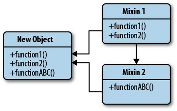

# ✨ [디자인 패턴 이름] 패턴

## 1. 패턴 정의: 정의와 핵심 요약

- Mixin 패턴은 상속 없이, 필요한 기능을 객체나 클래스에 “섞어 넣음(mix‑in)”으로써 재사용성을 확보하는 기법이다.
- 기존 객체에 기능을 덧붙이는 방식으로, 복잡한 상속 구조 없이 모듈화와 코드 재사용을 실현한다.

## 2. 사용 목적: 이 패턴이 필요한 이유

- 다중 상속을 지원하지 않는 JavaScript 환경에서, 다양한 기능을 여러 클래스에 공유하고 싶을 때 유용하다.
- 특정 동작(예: 이벤트, 로깅 등)을 여러 객체에 공통으로 적용할 경우, 중복 정의를 피하고 간결하게 확장할 수 있다.
- 복잡한 상속 체계 없이, 기능 단위로 모듈을 조립하듯 클래스/객체에 적용할 수 있다.

## 3. 패턴 설명: 동작 방식과 구성 요소



> 구성 요소

- Mixin 객체: 함수나 메서드가 포함된 단독 객체. 자체 인스턴스로 사용되지 않고, 기능 확장을 위한 역할만 수행한다.
- 타깃 객체/클래스: 기능을 확장하고 싶은 객체 또는 클래스의 프로토타입.

> 동작 방식

- `Object.assign(target, mixin)` 또는 `Object.assign(Class.prototype, mixin)`을 통해 mixin 객체의 메서드를 타깃에 복사한다.
- 타깃은 mixin의 기능을 갖게 되어, mixin에 정의된 메서드를 마치 자기 것처럼 사용할 수 있다.

> 장점

- 상속 구조 없이 기능 공유 가능 → 코드 복잡도 감소
- 필요한 기능만 선택적으로 조합 가능 → 유연성 증가
- 재사용성과 모듈화 확보

> 단점

- 충돌 시 덮어쓰기가 발생할 수 있음 (이름 중복 주의)
- Enumerable 속성으로 복사되어 인스턴스 순회 시 노출됨
- Getter/Setter 복사의 경우 주의 필요 (값이 복사될 뿐, getter가 유지되지 않을 수 있음)

## 4. 코드 및 활용 예시: 기본 구현과 프론트엔드 적용

### 기본 Mixin 사용 (Object.assign 활용 예시)

```ts
class Dog {
  constructor(name) {
    this.name = name;
  }
}

const dogFunctionality = {
  bark() {
    console.log("Woof!");
  },
  wagTail() {
    console.log("Wagging my tail!");
  },
  play() {
    console.log("Playing!");
  },
};

Object.assign(Dog.prototype, dogFunctionality);

const pet = new Dog("Daisy");
pet.bark(); // Woof!
pet.play(); // Playing!
```

### Mixin 기능을 Object.assign으로 복수 적용

```ts
const CanSwim = {
  swim() {
    console.log(`${this.name} is swimming.`);
  },
};
const CanJump = {
  jump() {
    console.log(`${this.name} is jumping.`);
  },
};
const fish = { name: "Goldfish" };
Object.assign(fish, CanSwim, CanJump);

fish.swim(); // Goldfish is swimming.
fish.jump(); // Goldfish is jumping.
```

### Getter 복사 시 주의

```ts
const mixin = {
  get random() {
    return Math.random();
  },
};

const obj = {};
Object.assign(obj, mixin);

console.log(obj.random); // 0.5342...
console.log(obj.random); // 0.9123...
```

## 5. 정리와 확장: 학습 포인트와 추가 학습거리

### 학습 포인트

- Mixin 패턴은 상속 없이 기능을 조합(composition) 하는 기법이다.
- 구현이 간단하고 유연하며, 재사용성과 모듈화를 높이는 데 효과적이다.
- 덮어쓰기, enumerable, Getter 복사 등 사용 시 주의 요소가 존재한다.
