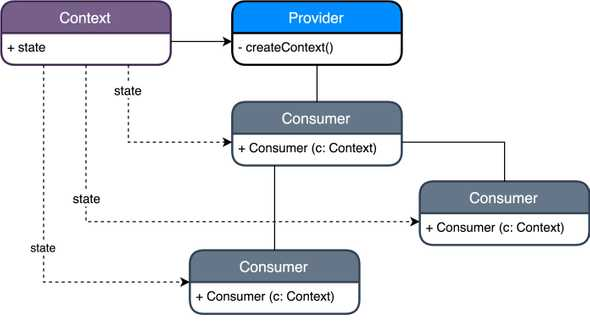

# ✨ Provider 패턴

## 1. 패턴 정의: 공식 정의와 핵심 요약

- `Provider` 패턴은 `prop drilling` 없이 컴포넌트가 직접 필요한 데이터에 접근할 수 있도록 한다.
- 이를 통해 중간 컴포넌트의 수정 없이도 전역 상태나 리소스를 깔끔하게 전달할 수 있게 해준다.

## 2. 사용 목적: 이 패턴이 필요한 이유

- 컴포넌트 트리에서 여러 자식 컴포넌트가 동일한 데이터에 접근해야 할 때, 중간 컴포넌트를 거쳐 데이터를 일일이 전달하는 `prop drilling` 문제가 발생한다.
- `Provider` 패턴은 특정 컴포넌트 계층 안에서 데이터를 공급하여, 필요한 자식 컴포넌트가 직접 데이터를 읽을 수 있도록 해준다.
- 이를 통해 중간 컴포넌트를 수정하지 않아도 되고, 컴포넌트 간의 결합도도 낮춰 유지보수성과 확장성을 높일 수 있다.

## 3. 패턴 설명: 동작 방식과 구성 요소



> 구성 요소

- `Provider`: 외부 의존성이나 데이터를 하위로 공급한다.

- `Consumer`: Provider를 통해 주입받은 데이터를 사용한다.

- `Context`: 실제 데이터나 기능을 담고 있는 컨테이너

> 동작 흐름

- `Provider`는 특정 값을 `context`로 감싸 트리 하위 컴포넌트들이 해당 값에 접근할 수 있도록 한다.
- 하위 컴포넌트는 별도의 props 전달 없이 `Context`를 구독하여 필요한 데이터를 가져온다.
- 중간 계층의 컴포넌트들은 `Context`를 직접 사용하지 않으며, `prop drilling` 없이도 데이터가 전달된다.

## 4. 코드 및 활용 예시: 기본 구현과 프론트엔드 적용

```tsx
// ThemeContext.tsx
import { createContext, useContext } from "react";

const ThemeContext = createContext<"light" | "dark">("light");

export const ThemeProvider = ({ children }: { children: React.ReactNode }) => {
  return <ThemeContext.Provider value="dark">{children}</ThemeContext.Provider>;
};

export const useTheme = () => useContext(ThemeContext);
```

```tsx
// App.tsx
import { ThemeProvider } from "./ThemeContext";
import Page from "./Page";

function App() {
  return (
    <ThemeProvider>
      <Page />
    </ThemeProvider>
  );
}
```

```tsx
// Page.tsx
import { useTheme } from "./ThemeContext";

function Page() {
  const theme = useTheme();
  return <div className={`theme-${theme}`}>현재 테마: {theme}</div>;
}
```

- 리액트에서는 주로 UI 전역 관리에 사용
- 테마/언어 설정, 인증 상태 관리, 다국어 번역(i18n), 모달/토스트/오버레이 관리, 폼 데이터, 필터 상태 등 공유 상태 관리 등
- 컴포넌트 간의 결합도를 낮추고, 유지보수성과 확장성을 높일 수 있다.

## 5. 정리와 확장: 학습 포인트

- `Provider` 패턴은 일반적으로 객체나 리소스를 외부에서 주입해 사용하도록 돕는 구조로, 프론트엔드 프레임워크에서는 컴포넌트 간 데이터 전달 문제를 해결하는 방식으로 사용된다.
- 예를들어 `React`에서는 중첩된 `props` 전달(`prop drilling`)을 줄이기 위한 수단으로 `Provider` 패턴(`Context API`)이 활용된다.
- 다만, `React`와 같은 프레임워크에서 `Provider` 패턴을 사용할 경우, `Provider` 하위의 모든 컴포넌트가 컨텍스트 값의 변경에 따라 리렌더링되는 단점이 존재한다.
