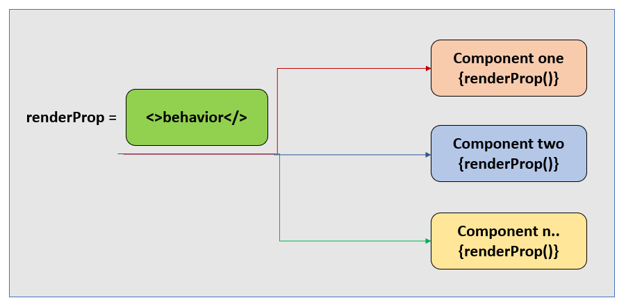

# ✨ Render Props 패턴

## 1. 패턴 정의: 정의와 핵심 요약

- Render Props 패턴은 컴포넌트가 함수를 props로 전달받아, 그 함수를 호출해 자식 UI를 결정하는 패턴이다.
- 로직과 상태 관리는 부모 컴포넌트가 맡고, 실제 렌더링은 소비자가 함수(children)를 통해 제어할 수 있다.

## 2. 사용 목적: 이 패턴이 필요한 이유

- 여러 컴포넌트에서 공통되는 로직(hover, fetch, subscribe 등)을 캡슐화하되, 마크업 구조는 소비자가 완전히 자유롭게 정의하고 싶을 때 사용한다.
- HOC처럼 감싸는 방식이 아닌, children-as-a-function 형태로 UI를 커스터마이징 가능하다.

## 3. 패턴 설명: 동작 방식과 구성 요소



### 구성 요소

- Provider 컴포넌트: 내부에서 상태/로직을 관리.
- Render Prop: 함수 형태의 children을 받아, 내부 상태를 인자로 넘김.

### 동작 방식

- Provider 컴포넌트가 로직(hover, 측정, 구독 등)을 실행하고, 결과를 render prop 함수의 인자로 전달.
- 소비자는 그 인자를 활용해 원하는 UI를 반환.

### 장단점

> 장점

- UI의 자유도 증가: 로직은 재사용하면서 마크업은 소비자가 제어 가능
- 관심사 분리: 로직과 뷰가 깔끔히 분리됨

> 단점

- children에 함수를 여러 번 중첩할 경우, 가독성이 급격히 떨어짐 (중첩 지옥)
- props 전달 과정에서 불필요한 리렌더가 발생할 수 있음

## 4. 코드 및 활용 예시: 기본 구현

```tsx
// 간단한 카운터 예시
const Counter = ({ children }) => {
  const [count, setCount] = useState(0);

  return (
    <div>
      {children({ count, increment: () => setCount(count + 1) })}
    </div>
  );
};

// 사용법 1: 버튼으로 표시
<Counter>
  {({ count, increment }) => (
    <button onClick={increment}>
      클릭 횟수: {count}
    </button>
  )}
</Counter>

// 사용법 2: 다른 UI로 표시
<Counter>
  {({ count, increment }) => (
    <div>
      <h2>현재 숫자: {count}</h2>
      <button onClick={increment}>+1</button>
    </div>
  )}
</Counter>
```

## 5. 정리와 확장: 학습 포인트와 추가 학습거리

### 학습 포인트

- Render Props는 로직 캡슐화 + 뷰 커스터마이징을 모두 가능하게 한다.
- 하지만 children 함수 중첩 구조로 인해 코드가 지저분해질 수 있고, 리렌더링 비용 관리가 필요하다.

### 추가 학습: 훅과 Render Props의 관계

- Render Props가 해결하던 문제(상태/효과 재사용)는 이제 커스텀 훅이 더 간단하게 해결한다.
- 예: `useCounter` 훅을 정의하면, 원하는 컴포넌트 안에서 바로 상태와 로직을 가져다 쓸 수 있다.
- 즉, 새 코드에서는 대부분 Render Props 대신 훅을 쓰는 것이 더 직관적이고 가독성도 좋다.

### 추가 학습: Render Props가 여전히 유효한 상황

- 헤드리스 컴포넌트 라이브러리: 내부 로직은 제공하되, 마크업은 소비자가 직접 그려야 하는 경우
  - 예: `<Measure>{({ bounds }) => <div>{bounds.width}</div>}</Measure>`
- 레거시 클래스 컴포넌트와의 호환: 훅을 쓸 수 없는 경우 중간 어댑터 역할
- 특정 부분만 커스터마이징이 필요한 경우: HOC처럼 전체를 감싸는 대신, 렌더링 지점 일부만 열어두고 싶을 때
